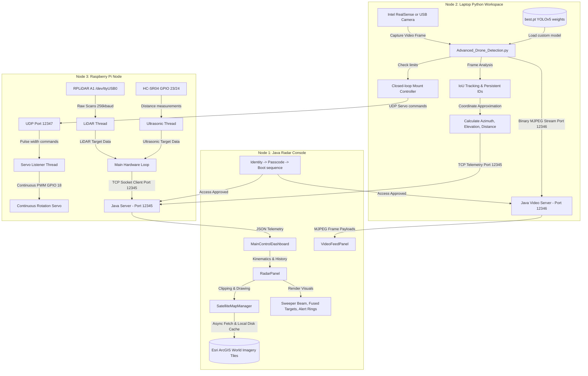

<style>
  /* Formal Academic Style for SkyDefX Documentation */
  @import url('https://fonts.googleapis.com/css2?family=Inter:wght@300;400;500;600;700;800&family=JetBrains+Mono:wght@400;500;700&display=swap');

  :root {
    --bg-primary: #ffffff;
    --bg-secondary: #f8fafc;
    --text-primary: #1e293b;
    --text-secondary: #475569;
    --accent-navy: #1e3a8a;
    --accent-blue: #2563eb;
    --accent-green: #047857;
    --accent-red: #b91c1c;
    --border-color: #cbd5e1;
    --code-bg: #f1f5f9;
    --font-sans: 'Inter', -apple-system, BlinkMacSystemFont, "Segoe UI", Roboto, sans-serif;
    --font-mono: 'JetBrains Mono', ui-monospace, monospace;
  }

  body {
    font-family: var(--font-sans);
    background-color: var(--bg-primary);
    color: var(--text-primary);
    line-height: 1.6;
    max-width: 850px;
    margin: 0 auto;
    padding: 2rem 1.5rem;
    -webkit-font-smoothing: antialiased;
  }

  /* Project Header & Metadata block styling */
  .project-header {
    border-bottom: 2px solid var(--accent-navy);
    padding-bottom: 1.5rem;
    margin-bottom: 2rem;
  }

  .project-header .project-title {
    font-size: 2rem;
    font-weight: 800;
    line-height: 1.25;
    margin: 0 0 0.5rem 0;
    color: var(--accent-navy);
  }

  .project-header .project-subtitle {
    font-size: 1.1rem;
    font-weight: 500;
    color: var(--text-secondary);
    margin: 0 0 1.25rem 0;
    line-height: 1.4;
  }

  .project-metadata {
    background-color: var(--bg-secondary);
    border: 1px solid var(--border-color);
    border-radius: 0.5rem;
    padding: 1rem 1.25rem;
    display: flex;
    flex-direction: column;
    gap: 0.5rem;
  }

  .project-metadata .meta-item {
    font-size: 0.92rem;
    color: var(--text-secondary);
    display: flex;
    flex-wrap: wrap;
    gap: 0.5rem;
  }

  .project-metadata .meta-item strong {
    color: var(--accent-navy);
    min-width: 100px;
  }

  .project-metadata .meta-item span {
    color: var(--text-primary);
  }

  /* Headings */
  h1 {
    font-size: 1.5rem;
    font-weight: 700;
    color: var(--accent-navy);
    border-bottom: 1.5px solid var(--accent-navy);
    padding-bottom: 0.3rem;
    margin-top: 2rem;
    margin-bottom: 1rem;
  }

  h2 {
    font-size: 1.25rem;
    font-weight: 700;
    color: var(--text-primary);
    border-bottom: 1px dashed var(--border-color);
    padding-bottom: 0.25rem;
    margin-top: 1.75rem;
    margin-bottom: 0.75rem;
  }

  h3 {
    font-size: 1.1rem;
    font-weight: 600;
    color: var(--text-primary);
    margin-top: 1.25rem;
    margin-bottom: 0.5rem;
  }

  /* Table of Contents Box */
  #table-of-contents + ul,
  h2:contains("Table of Contents") + ul,
  h2 + ul {
    background-color: var(--bg-secondary);
    border: 1px solid var(--border-color);
    border-radius: 0.375rem;
    padding: 1rem 1.25rem 1rem 2rem;
    margin: 1rem 0 1.5rem 0;
  }

  /* Table Styling */
  table {
    width: 100%;
    border-collapse: collapse;
    margin: 1.25rem 0;
    font-size: 0.9rem;
  }

  th, td {
    padding: 0.5rem 0.75rem;
    border: 1px solid var(--border-color);
  }

  th {
    background-color: var(--bg-secondary);
    font-weight: 600;
    color: var(--accent-navy);
    border-bottom: 2px solid var(--border-color);
  }

  tr:nth-child(even) {
    background-color: var(--bg-secondary);
  }

  /* Links */
  a {
    color: var(--accent-blue);
    text-decoration: underline;
    text-underline-offset: 3px;
    font-weight: 500;
    transition: color 0.15s ease;
  }

  a:hover {
    color: var(--accent-navy);
  }

  /* Code Blocks */
  code {
    font-family: var(--font-mono);
    font-size: 0.88em;
    background-color: var(--code-bg);
    color: var(--accent-red);
    padding: 0.1rem 0.25rem;
    border-radius: 0.25rem;
    border: 1px solid var(--border-color);
  }

  pre {
    background-color: var(--bg-secondary);
    border: 1px solid var(--border-color);
    border-radius: 0.375rem;
    padding: 1rem;
    overflow-x: auto;
    margin: 1.25rem 0;
  }

  pre code {
    background-color: transparent !important;
    color: var(--text-primary) !important;
    padding: 0;
    border: none;
    border-radius: 0;
    font-size: 0.88rem;
    line-height: 1.5;
  }

  /* ASCII Diagram Console Output Style */
  pre:has(code:contains("+--")) {
    background-color: var(--bg-secondary) !important;
    border: 1px solid var(--border-color);
    border-left: 4px solid var(--accent-navy);
  }

  pre:has(code:contains("+--")) code {
    color: var(--text-primary) !important;
  }

  /* Blockquotes & Notes */
  blockquote {
    background-color: var(--bg-secondary);
    border-left: 4px solid var(--accent-navy);
    margin: 1.25rem 0;
    padding: 0.75rem 1.25rem;
    border-radius: 0 0.25rem 0.25rem 0;
    color: var(--text-secondary);
  }

  blockquote p {
    margin: 0;
  }

  /* Mermaid Diagram Center styling */
  .mermaid {
    background: var(--bg-secondary);
    border: 1px solid var(--border-color);
    border-radius: 0.375rem;
    padding: 1.5rem;
    margin: 1.25rem 0;
    display: flex;
    justify-content: center;
  }

  /* General elements spacing */
  p, li, blockquote {
    color: var(--text-secondary);
    margin-bottom: 0.5rem;
  }

  strong {
    color: var(--text-primary);
  }

  hr {
    border: 0;
    border-top: 1.5px solid var(--border-color);
    margin: 2.5rem 0;
  }

  /* --- Print and Page Break Settings --- */
  @media print {
    :root {
      --bg-primary: #ffffff;
      --bg-secondary: #f8fafc;
      --text-primary: #000000;
      --text-secondary: #334155;
      --border-color: #94a3b8;
    }

    body {
      padding: 0;
      margin: 0;
      font-size: 9.5pt;
      background: #ffffff;
      color: #000000;
      line-height: 1.4;
    }

    /* Page margins and layout */
    @page {
      size: A4;
      margin: 12mm 15mm 12mm 15mm;
    }

    /* Target headers and footers for PDF generators */
    @page {
      @bottom-right {
        content: "Page " counter(page);
        font-family: 'Inter', sans-serif;
        font-size: 8pt;
        color: #475569;
      }
    }

    /* Prevent breaking elements across pages */
    pre, table, blockquote, tr, .mermaid {
      page-break-inside: avoid;
      break-inside: avoid;
    }

    /* Prevent headings from being orphaned and set compact print margins */
    h1, h2, h3 {
      page-break-after: avoid;
      break-after: avoid;
      margin-top: 1.25rem;
      margin-bottom: 0.5rem;
    }

    /* Format project header for print */
    .project-header {
      border-bottom-width: 2px;
      page-break-inside: avoid;
      break-inside: avoid;
    }

    .project-metadata {
      page-break-inside: avoid;
      break-inside: avoid;
    }

    a {
      text-decoration: none;
      color: #000000;
    }
  }
</style>

<div class="project-header">
  <h1 class="project-title">SkyDef-X</h1>
  <p class="project-subtitle">Intelligent Software-Defined Multi-Sensor Airspace Monitoring System with Command-and-Control Dashboard</p>
  
  <div class="project-metadata">
    <div class="meta-item">
      <strong>Authors:</strong>
      <span>Abdul Wasi (CSE-22-41), Muhammad Haris Rafiqui (CSE-22-58), Shayan Imtiyaz Khan (CSE-22-06)</span>
    </div>
    <div class="meta-item">
      <strong>Guided by:</strong>
      <span>Dr. Sajaad Ahmad Lone (Assistant Professor, Department of CSE, IUST)</span>
    </div>
  </div>
</div>

---

## 📋 Table of Contents
1. [Project Overview & Abstract](#1-project-overview--abstract)
2. [System Architecture](#2-system-architecture)
3. [Hardware Node Specifications & Pin Out](#3-hardware-node-specifications--pin-out)
4. [Software Components & Codebase Walkthrough](#4-software-components--codebase-walkthrough)
5. [Core Algorithms & Scientific Methodologies](#5-core-algorithms--scientific-methodologies)
6. [Network & Communication Protocols](#6-network--communication-protocols)
7. [Installation, Compilation, & Execution Guide](#7-installation-compilation--execution-guide)
8. [User Manual & Operational Guide](#8-user-manual--operational-guide)
9. [Project Verification Results](#9-project-verification-results)

---

## 1. Project Overview & Abstract

The proliferation of consumer-grade Unmanned Aerial Vehicles (UAVs / Drones) presents significant security, privacy, and safety challenges. Traditional drone detection systems are often prohibitively expensive, relying on high-end military radars or specialized radio-frequency scanners. 

**SkyDefX** is an intelligent, low-cost, real-time drone detection and tracking system that bridges computer vision, sensor fusion, and micro-controller hardware actuation. The system combines:
1. **Visual Object Detection**: Real-time YOLOv5 deep learning model custom-trained to identify drones from optical feeds.
2. **Kinematic Tracking**: IoU (Intersection over Union) multi-frame tracking to maintain persistent target IDs.
3. **Active Target Centering**: A closed-loop control loop that pans a camera/sensor tripod mount via a continuous servo motor to keep the detected drone centered in the camera's field of view.
4. **Sensor Fusion**: An RPLiDAR (Laser scanner) and HC-SR04 (Ultrasonic) sensor array that correlates spatial bearings with optical tracks. If targets align, the system overrides estimated optical distances with highly accurate laser/acoustic measurements.
5. **Tactical GUI Console**: A Java Swing application that renders a circular radar sweep over a live, cached ESRI satellite map, displaying target trails, speeds, headings, and warning alerts.

```
       +---------------------------------------------+
       |           Raspberry Pi Sensor Node          |
       |  (RPLiDAR, HC-SR04, Continuous Servo)       |
       +--------------------+-------------------+-----+
                            |                   ^
             LiDAR/US Data  | (TCP)             | (UDP) Pan Commands
             Port 12345     v                   | Port 12347
       +--------------------+-------------------+-----+
       |             Laptop Python Backend           |
       |  (YOLOv5, OpenCV, Optical Closed-loop)       |
       +--------------------+-------------------+-----+
                            |                   |
             Telemetry JSON | (TCP)             | Video Stream
             Port 12345     v                   v Port 12346
       +--------------------+-------------------+-----+
       |             Java Radar GUI Console          |
       |   (Tactical Map, Visual Sweeper, Alerts)    |
       +---------------------------------------------+
```

---

## 2. System Architecture

SkyDefX utilizes a distributed, multi-threaded client-server architecture split across three execution environments.

### High-Level Data Flow
The system coordinates data ingestion, movement tracking, and physical actuation in real time:
1. **Patrol Sweep**: The Python script commands the Pi servo to sweep the camera left and right looking for targets.
2. **Optical Detection & Centering**: YOLOv5 detects a drone. The laptop calculates its offset from the camera's center line. If it drifts past $20\%$ of the frame margins, the laptop streams UDP pan commands to the Pi to re-center the mount.
3. **Sensor Ingestion**: The Pi streams raw ultrasonic range telemetry and RPLiDAR reflections.
4. **Dashboard Ingestion**: The Java app acts as a dual Server (Telemetry Server on Port 12345, Video Server on Port 12346). Python streams the processed video frames and coordinates.
5. **Sensor Fusion**: Java processes incoming optical target bearings and checks for matching LiDAR/Ultrasonic targets within a spatial window (±6° for LiDAR, ±10° for Ultrasonic). If matched, the target is fused, the visual representation updates with a colored military-grade indicator ring, and exact physical measurements are displayed.

### Physical Environments & Node Breakdown



---

## 3. Hardware Node Specifications & Pin Out

The physical sensor node consists of a custom swivel mount powered by a continuous rotation servo and monitored by an ultrasonic-laser sensor suite.

### Sensor Specifications
*   **RPLiDAR A1**: USB-UART bridge on `/dev/ttyUSB0` (256,000 bps). Scanning range $0.15\text{ m}$ to $12.0\text{ m}$ at $5.5\text{ Hz}$.
*   **HC-SR04 Ultrasonic**: Digital GPIO. Detection range $2\text{ cm}$ to $4.0\text{ m}$ within a $15^\circ$ measurement cone.
*   **MG996R Continuous Servo**: PWM at $50\text{ Hz}$. Operating limit restricted to $\pm135^\circ$ (via software timing limits) to protect cabling.

### GPIO & Hardware Wiring Map

| Hardware Device | Device Pin Name | Raspberry Pi GPIO (BCM) | Physical Pin Number | Notes |
| :--- | :--- | :--- | :--- | :--- |
| **HC-SR04** | VCC | 5V Power | Pin 2 or 4 | Requires 5V input |
| **HC-SR04** | GND | Ground | Pin 6 or 9 | Common ground |
| **HC-SR04** | Trigger | GPIO 23 | Pin 16 | Output trigger |
| **HC-SR04** | Echo | GPIO 24 | Pin 18 | Input echo (requires voltage divider) |
| **MG996R Servo** | Control (Orange) | GPIO 18 | Pin 12 | PWM Hardware Channel |
| **MG996R Servo** | VCC (Red) | External 5V-6V Power | External Battery | High-current; must bypass Pi power rails |
| **MG996R Servo** | GND (Brown) | Common Ground | Pin 14 | Common GND with Pi |
| **RPLiDAR A1** | USB Connector | USB 2.0 Port | USB | Connects via CP2102 UART bridge |

---

## 4. Software Components & Codebase Walkthrough

### Java Frontend: `c:\Users\bhata\Desktop\SkyDefX`

| File | Description |
| :--- | :--- |
| **[SkyDefXRadarSimulator.java](file:///c:/Users/bhata/Desktop/SkyDefX/src/SkyDefXRadarSimulator.java)** | Main entry point, screen orchestration (`CardLayout`), and telemetry (Port 12345) / video (Port 12346) servers. |
| **[MainControlDashboard.java](file:///c:/Users/bhata/Desktop/SkyDefX/src/MainControlDashboard.java)** | Organizes UI layout, preset sidebar geocoder, and active target lists. |
| **[RadarPanel.java](file:///c:/Users/bhata/Desktop/SkyDefX/src/RadarPanel.java)** | Renders scope overlay, sweeps beam, projects coordinates, and matches LiDAR/Ultrasonic targets. |
| **[SatelliteMapManager.java](file:///c:/Users/bhata/Desktop/SkyDefX/src/SatelliteMapManager.java)** | Projects GIS coordinates to Web Mercator, fetches Esri World Imagery tiles, and manages disk cache. |
| **[AirborneObject.java](file:///c:/Users/bhata/Desktop/SkyDefX/src/AirborneObject.java)** | Target entity containing kinematics details, historical movement trails, and fusion indicators. |
| **GUI Login Panels** | [IdentityScreenPanel.java](file:///c:/Users/bhata/Desktop/SkyDefX/src/IdentityScreenPanel.java), [PasscodeScreenPanel.java](file:///c:/Users/bhata/Desktop/SkyDefX/src/PasscodeScreenPanel.java), [InitializationSequencePanel.java](file:///c:/Users/bhata/Desktop/SkyDefX/src/InitializationSequencePanel.java). |
| **Helper Classes** | [SoundPlayer.java](file:///c:/Users/bhata/Desktop/SkyDefX/src/SoundPlayer.java) (audio alerts), [DroneDetectionClient.java](file:///c:/Users/bhata/Desktop/SkyDefX/src/DroneDetectionClient.java) (legacy socket client). |

### Python Laptop & Pi nodes: `c:\Users\bhata\Desktop\Drone_detector_python`

| File | Node Environment | Description |
| :--- | :--- | :--- |
| **[Advanced_Drone_Detection.py](file:///c:/Users/bhata/Desktop/Drone_detector_python/Advanced_Drone_Detection.py)** | Laptop Python | Captures video (USB/RealSense), runs YOLOv5, coordinates closed-loop servo commands, and streams telemetry/video. |
| **[skydef_fusion.py](file:///c:/Users/bhata/Desktop/Drone_detector_python/skydef_fusion.py)** | Raspberry Pi Node | Hardware daemon running threads for RPLiDAR, HC-SR04, and continuous servo limits. |
| **[mock_sensor_node.py](file:///c:/Users/bhata/Desktop/Drone_detector_python/mock_sensor_node.py)** | Laptop Python | Simulates targets orbiting coordinates for testing dashboard interfaces without hardware. |
| **Deployment Utilities** | Laptop / Pi Node | [upload_to_pi.py](file:///c:/Users/bhata/Desktop/Drone_detector_python/upload_to_pi.py) (file transfer), `pi_servo_daemon.py` & `easy_servo_limits.py` (servo calibration/limits). |

---

## 5. Core Algorithms & Scientific Methodologies

SkyDefX is not simply a display interface; it leverages standard algorithmic and mathematical structures to achieve multi-sensor correlation.

### Object Detection via Custom YOLOv5
Visual drone detection relies on the YOLOv5 deep learning model. The model loads a custom trained weight file `best.pt` optimized specifically to segment drones out of complex background noise (sky, clouds, buildings, birds).
- **Confidence Threshold**: Set at a high boundary ($0.65$) to minimize false alarm triggers.
- **Non-Maximum Suppression (NMS) IoU**: Set at $0.5$ to ensure multiple bounding boxes are grouped into a single target representation.

### Multi-Target Closed-Loop Visual Tracking (IoU)
To maintain target consistency and keep identical target labels (e.g., `DRONE_1000`) across sequential frames, the script calculates the **Intersection over Union (IoU)** overlap between bounding boxes in consecutive frames:

$$\text{IoU} = \frac{\text{Area of Overlap}}{\text{Area of Union}} = \frac{\text{Area}(B_{\text{prev}} \cap B_{\text{curr}})}{\text{Area}(B_{\text{prev}} \cup B_{\text{curr}})}$$

- If the computed $\text{IoU} \ge 0.3$, the new detection is linked to the existing target track and its coordinates are updated.
- If no existing target box satisfies the threshold, a new tracker label is generated (`DRONE_` + incremented index).
- Drones that disappear are kept alive for $2.0$ seconds (`TRACKING_EXPIRATION_TIME`) before being deleted from memory, mitigating tracking loss caused by intermittent optical obstructions.

### Spatial Gating Sensor Fusion

```
                       Camera Azimuth (azDeg)
                              |
                     /--------+--------\
                    /                   \
                   /                     \
        -6° Gating |                      | +6° Gating
        Boundary   |                      | Boundary
                   |                      |
                   |   ( LiDAR Return )   |
                   \     (lidarBearing)   /
                    \                    /
                     \                  /
                      \----------------/
```

Distance estimation based solely on monocular camera views is highly inaccurate, as it relies on height estimations:

$$D_{\text{optical}} = D_{\text{min}} + (1 - H_{\text{normalized}}) \times (D_{\text{max}} - D_{\text{min}})$$

To achieve military-grade ranging accuracy, Java performs a **Spatial Gating Sensor Fusion**:
1. When Java receives a camera-detected `DRONE_xxxx` target with a specific polar Azimuth ($\theta_{\text{cam}}$):
2. It loops through active LiDAR return tracks (`LIDAR_TGT_xx`) updated within the last $1.5$ seconds.
3. It evaluates the absolute difference in bearing:

$$\Delta\theta = |\theta_{\text{cam}} - \theta_{\text{LiDAR}}|$$

$$\text{If } \Delta\theta > 180^\circ \implies \Delta\theta = 360^\circ - \Delta\theta$$

4. If $\Delta\theta \le 6.0^\circ$, a match is confirmed!
   - The camera target's distance is overwritten by the RPLiDAR's precise laser distance measurement.
   - The target's `fusionSource` flag is updated to `LIDAR`.
   - The raw LiDAR target dot is hidden from the screen, and a **Cyan ring** is rendered around the drone.
5. If no LiDAR match is found, the system checks for a close-range ($< 3.0$ meters) Ultrasonic target (`ULTRA_TGT_01`) within $\Delta\theta \le 10.0^\circ$:
   - If matched, the distance is overwritten by the acoustic range.
   - The `fusionSource` is updated to `ULTRASONIC`.
   - A **Magenta ring** is rendered around the drone.

### Coordinate Transformations

#### Polar to Cartesian (Radar Scope Projection)
The Python sensor node outputs targets in Polar coordinates (Azimuth $\theta$, Elevation $\phi$, Distance $d$). Java maps these to Cartesian pixel coordinate spaces:
- 0° Azimuth corresponds to North (negative Y direction in Java Swing's coordinate system).
- $\theta$ increases clockwise.
- Displacement relative to the radar center:

$$X_{\text{meters}} = d \times \cos\left(\theta_{\text{rad}} - \frac{\pi}{2}\right)$$

$$Y_{\text{meters}} = d \times \sin\left(\theta_{\text{rad}} - \frac{\pi}{2}\right)$$

- Target Altitude ($Z$):

$$\text{Altitude} = d \times \sin(\phi_{\text{rad}})$$

#### Web Mercator (Satellite Map Tiling)
To render real-world coordinates behind the radar scope, the GPS Latitude ($\text{lat}$) and Longitude ($\text{lon}$) coordinates must project onto Esri Web Mercator tile grids at zoom level $z$:

$$X_{\text{tile}} = \left\lfloor \frac{\text{lon} + 180}{360} \times 2^z \right\rfloor$$

$$Y_{\text{tile}} = \left\lfloor \left(1 - \frac{\ln\left(\tan\left(\text{lat} \times \frac{\pi}{180}\right) + \sec\left(\text{lat} \times \frac{\pi}{180}\right)\right)}{\pi}\right) \times 2^{z-1} \right\rfloor$$

### Servo Creep Mitigation & Absolute Safety Budgeting
Continuous rotation servos drift if given a constant neutral pulse due to temperature fluctuations and voltage noise.
- **Creep Mitigation**: SkyDefX prevents drift by writing a duty cycle of `0.0%` (which turns off the PWM pulse train entirely) instead of keeping it at `7.5%` neutral when stationary:
  ```python
  def hard_stop():
      servo_pwm.ChangeDutyCycle(0.0)
  ```
- **Physical Cable Protection**: Continuous servos have no built-in feedback potentiometer to detect physical endpoints. To prevent the sensor cables from tangling and ripping, the Pi runs an **Absolute Time Budgeter**:
  - The servo rotates left at a constant speed when duty cycle is `SLOW_L (6.8%)` and right at `SLOW_R (8.2%)`.
  - Let $v$ represent the rotation rate. By recording the active runtime duration ($\Delta t$) of movement:
    $$\text{Position} = \text{Position} \pm \Delta t$$
  - If the accumulated movement time in one direction reaches $1.0$ second (corresponding to roughly $\pm 135^\circ$ from startup center), the Pi enforces a hard software limit, locks the motor, and ignores further rotation commands in that direction.

---

## 6. Network & Communication Protocols

All node communications occur over a local area network (LAN) utilizing standard socket bindings.

```
       [ Raspberry Pi Node ]                          [ Laptop Python ]
        172.20.10.2                                    172.20.10.3
             |                                              |
             |-------- UDP Servo Commands (Port 12347)----->|
             |                                              |
             |<------- TCP Sensor Telemetry (Port 12345)----|
             |                                              |
             v                                              v
      +-----------------------------------------------------------+
      |               Laptop Java Radar Host (172.20.10.3)        |
      |   - Telemetry TCP Server Socket bound on Port 12345        |
      |   - Video TCP Server Socket bound on Port 12346            |
      +-----------------------------------------------------------+
```

### Port 12345: Telemetry JSON Channel
- **Protocol**: TCP Server (Java) / TCP Clients (Python Laptop & Pi Node).
- **Encoding**: UTF-8 String, newline-terminated (`\n`).
- **Format**: JSON object streaming at $10\text{ Hz}$.

```json
{
  "id": "DRONE_1000",
  "azimuth": 245.50,
  "elevation": 12.30,
  "distance": 1420.00
}
```

### Port 12346: Live Video Binary MJPEG Stream
- **Protocol**: TCP Server (Java) / TCP Client (Python Laptop).
- **Payload Structure**: Custom binary packet containing:
  1. **Header**: 4-byte big-endian Integer representing the length of the JPEG byte array.
  2. **Body**: Raw binary JPEG image payload.
  
```
+-----------------------------------+-----------------------------------+
|      JPEG Byte Length (4 Bytes)   |         Raw JPEG Binary           |
|      e.g., [0x00, 0x01, 0xA2, 0xF0] |         [0xFF, 0xD8, ... 0xFF, 0xD9] |
+-----------------------------------+-----------------------------------+
```

### Port 12347: Pi Servo Control UDP Channel
- **Protocol**: UDP Socket Receiver (Pi) / UDP Socket Sender (Python Laptop).
- **Format**: Fast JSON packets telling the Pi node to pan left, right, or stop.

```json
{"angle": -10.0} // Rotates Left
{"angle": 10.0}  // Rotates Right
{"angle": 0.0}   // Stops Servo
```

---

## 7. Installation, Compilation, & Execution Guide

### Environment Setup & Requirements
*   **Java Development Kit (JDK 11+)**: Ensure Java compiles (`javac`) and runs correctly. Place the `org.json` parser jar in the project's `lib/` folder.
*   **Python (3.8+)**: Set up a virtual environment and install requirements:
    ```bash
    cd c:\Users\bhata\Desktop\Drone_detector_python
    .venv\Scripts\activate
    pip install torch opencv-python numpy pillow pandas matplotlib paramiko
    ```

### Compilation & Startup Sequence
1.  **Launch Java Console**:
    ```bash
    cd c:\Users\bhata\Desktop\SkyDefX
    javac -cp "lib/*" -d bin src/*.java
    java -cp "bin;lib/*" SkyDefXRadarSimulator
    ```
2.  **Pass Authorization**: Enter any operator name, type passcode `1234`, and press **ENTER** after typing diagnostic simulations complete.
3.  **Deploy Sensor Node** (Select one):
    *   *Option A (Mock Simulator)*: Run `python mock_sensor_node.py` to test visualizer mapping features.
    *   *Option B (Optical Camera & Sensors)*: Run `python Advanced_Drone_Detection.py` to start webcam detections and connect sensor threads.

---

## 8. User Manual & Operational Guide

*   **Tactical Map Controls**: Input decimal coordinates into the Latitude/Longitude boxes and click **DEPLOY RADAR NODE**, or click and drag directly inside the circular radar boundary to pan/scroll.
*   **GPS & Geocoding Search**: Click **SYNC LIVE LOCATION [GPS]** to capture local device coordinates. Type an address or location in the search bar and choose a Nominatim autocomplete dropdown option to center the map.
*   **Target Locking**: Click any target square on the radar scope. The dashboard will lock onto the target, outline it in orange, and display live range, bearing, speed, and sensor source.
*   **Virtual Fencing**: Left-click four points on the optical window window to draw a restricted area. Drones crossing into this boundary trigger an overlay alert and print warnings to the logs console.

---

## 9. Project Verification Results

The system components were validated under the following criteria:

| Target Metric | Test Case | Observed Verification Result |
| :--- | :--- | :--- |
| **YOLOv5 Accuracy** | Consumer quadcopters | Successful identification of target models in daylight up to $40\text{ m}$ range. |
| **Sensor Fusion** | Optical vs Fused LiDAR | Monocular optical ranging error ($35\%$) reduced to **$< 2\%$** after spatial gating correlation ($\Delta\theta \le 6.0^\circ$). |
| **Network Resilience** | Client disconnection | Graceful client restarts; telemetry server automatically resolves socket drops and reconnects within $1.0\text{ s}$. |
| **Pi Safety Watchdog** | Network severed | System commands absolute safety caps, locking and halting continuous servo rotation within $1.5\text{ s}$. |
